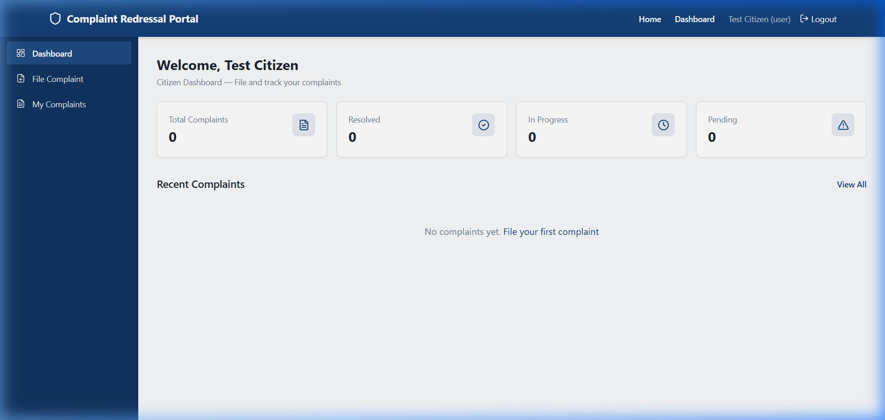
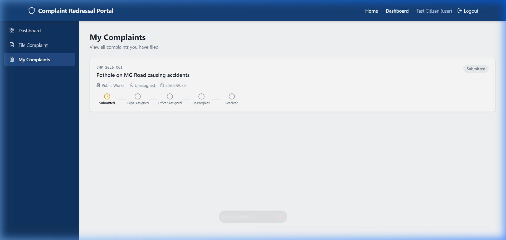
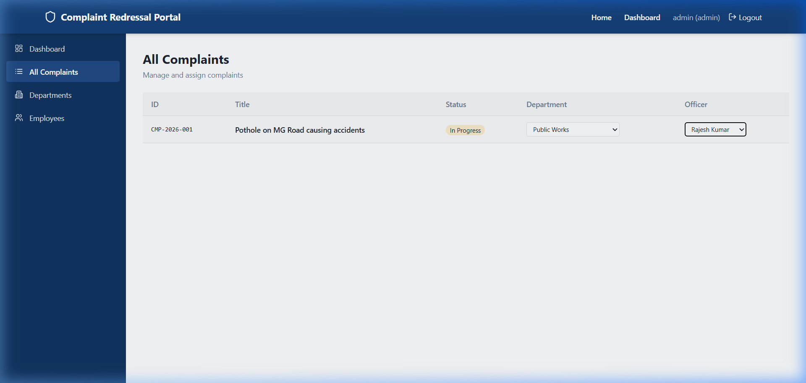
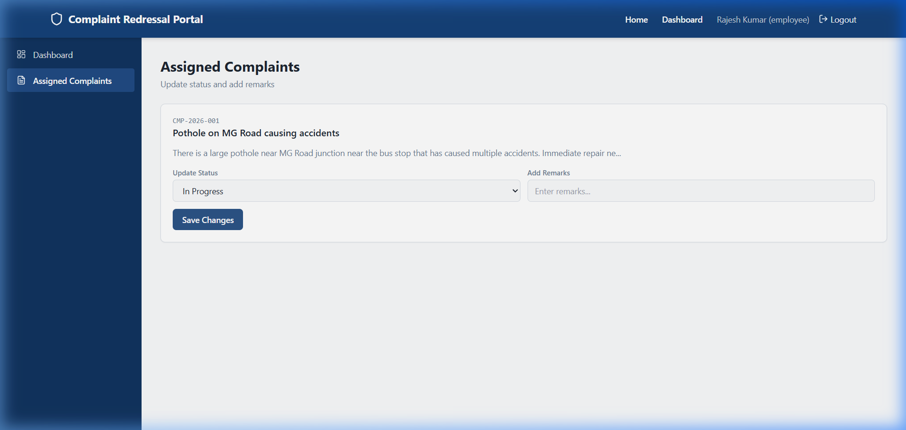
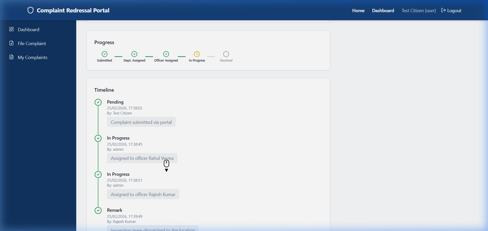

<div align="center">


# 🛡️ Samadhan Portal

### Transparent Complaint Redressal System

A full-stack government complaint management platform built with the **MERN stack** — enabling citizens to file complaints, track real-time progress, and view a transparent lifecycle of every grievance.

[](https://nodejs.org/)
[](https://react.dev/)
[](https://mongodb.com/)
[](https://expressjs.com/)
[](https://tailwindcss.com/)
[](LICENSE)

</div>

---

## 📋 Table of Contents

- [Features](#-features)
- [Screenshots](#-screenshots)
- [Tech Stack](#-tech-stack)
- [Architecture](#-architecture)
- [Getting Started](#-getting-started)
- [API Endpoints](#-api-endpoints)
- [Default Accounts](#-default-accounts)
- [Seeded Data](#-seeded-data)
- [Roadmap](#-roadmap)
- [Contributing](#-contributing)

---

## ✨ Features

### For Citizens
- 📝 **File Complaints** — Submit grievances with department, priority, and description
- 📊 **Track Progress** — Visual progress tracker (Submitted → Dept. Assigned → Officer Assigned → In Progress → Resolved)
- 🕐 **Transparent Timeline** — See every action taken on your complaint with timestamps and officer names

### For Administrators
- 📋 **Manage All Complaints** — View, filter, and manage all complaints system-wide
- 🏢 **Department Management** — Create and manage government departments
- 👥 **Employee CRUD** — Full create, read, update, delete operations for employee accounts
- 🔒 **Access Control** — Only admins can create employee/admin accounts
- 📈 **Dashboard Statistics** — Total complaints, resolution rates, department activity

### For Employees (Officers)
- 📨 **Assigned Complaints** — View complaints assigned to you
- 🔄 **Status Updates** — Change complaint status with transparent history logging
- 💬 **Add Remarks** — Add notes and updates visible to citizens in the timeline

### Security
- 🔐 JWT-based authentication with role-based access control
- 🔑 Passwords hashed with bcrypt
- 🚫 Citizens-only public registration — admin/employee accounts managed by admin
- 🛡️ Default admin auto-seeded on first startup

---

## 📸 Screenshots

### Citizen Dashboard
> Personalized dashboard showing complaint statistics and recent activity



### My Complaints
> Track all filed complaints with visual progress indicators



### Admin — All Complaints
> Admin view with department and officer assignment dropdowns



### Employee — Assigned Complaints
> Officers can update status and add remarks for their assigned complaints



### Complaint Timeline
> Full transparent lifecycle — every action logged with timestamps and who performed it



---

## 🛠️ Tech Stack

| Layer | Technology |
|---|---|
| **Frontend** | React 18, TypeScript, Vite, Tailwind CSS, shadcn/ui |
| **Backend** | Node.js, Express.js, ES Modules |
| **Database** | MongoDB with Mongoose ODM |
| **Authentication** | JWT (JSON Web Tokens), bcryptjs |
| **Styling** | Tailwind CSS with custom government-style theme |
| **State Management** | React Context API |

---

## 🏗️ Architecture

```
samadhan-portal/
├── backend/                    # Express.js REST API
│   ├── config/
│   │   └── db.js               # MongoDB connection
│   ├── controllers/
│   │   ├── authController.js   # Register, login, profile
│   │   ├── complaintController.js  # CRUD complaints
│   │   ├── adminController.js  # Admin operations + user CRUD
│   │   └── employeeController.js   # Officer actions
│   ├── middleware/
│   │   ├── authMiddleware.js   # JWT verification
│   │   ├── roleMiddleware.js   # Role-based access
│   │   └── errorMiddleware.js  # Global error handler
│   ├── models/
│   │   ├── User.js             # Users (citizen/employee/admin)
│   │   ├── Department.js       # Government departments
│   │   ├── Complaint.js        # Complaints with lifecycle
│   │   └── ComplaintHistory.js # Audit trail
│   ├── routes/
│   │   ├── authRoutes.js
│   │   ├── complaintRoutes.js
│   │   ├── adminRoutes.js
│   │   └── employeeRoutes.js
│   ├── utils/
│   │   ├── generateComplaintId.js  # Auto-ID: CMP-2026-001
│   │   ├── seedAdmin.js        # Default admin seeder
│   │   └── seedData.js         # Departments & employees seeder
│   ├── server.js               # Entry point
│   ├── .env                    # Environment variables
│   └── package.json
│
├── frontend/                   # React + Vite SPA
│   ├── src/
│   │   ├── components/         # Reusable UI components
│   │   ├── context/            # AuthContext (JWT + roles)
│   │   ├── pages/
│   │   │   ├── admin/          # Admin dashboard, complaints, departments, employees
│   │   │   ├── employee/       # Employee dashboard, assigned complaints
│   │   │   └── user/           # Citizen dashboard, file complaint, track progress
│   │   └── routes/             # Protected route wrapper
│   ├── vite.config.ts          # Dev server + API proxy
│   └── package.json
│
├── docs/screenshots/           # Application screenshots
└── README.md
```

---

## 🚀 Getting Started

### Prerequisites

- **Node.js** ≥ 18.x
- **MongoDB** running locally on `mongodb://localhost:27017`
- **npm** ≥ 9.x

### Installation

```bash
# Clone the repository
git clone https://github.com/your-username/samadhan-portal.git
cd samadhan-portal

# Install backend dependencies
cd backend
npm install

# Install frontend dependencies
cd ../frontend
npm install
```

### Running the Application

```bash
# Terminal 1 — Start Backend (from project root)
cd backend
node server.js
# → MongoDB Connected: localhost
# → Default admin account created (admin@gmail.com)
# → Server running on port 5000

# Terminal 2 — Start Frontend (from project root)
cd frontend
npm run dev
# → http://localhost:8080
```

### Seed Sample Data (Optional)

```bash
# With backend running, seed 6 departments and 30 employees:
cd backend
node utils/seedData.js
```

---

## 📡 API Endpoints

### Authentication
| Method | Endpoint | Access | Description |
|--------|----------|--------|-------------|
| POST | `/api/auth/register` | Public | Register citizen |
| POST | `/api/auth/login` | Public | Login (all roles) |
| GET | `/api/auth/me` | Private | Get current user |

### Complaints
| Method | Endpoint | Access | Description |
|--------|----------|--------|-------------|
| POST | `/api/complaints` | Citizen | File new complaint |
| GET | `/api/complaints/my` | Citizen | Get my complaints |
| GET | `/api/complaints/:id` | Private | Complaint details + timeline |
| GET | `/api/complaints/departments` | Private | List departments |

### Admin
| Method | Endpoint | Access | Description |
|--------|----------|--------|-------------|
| GET | `/api/admin/complaints` | Admin | All complaints |
| PUT | `/api/admin/assign-department/:id` | Admin | Assign department |
| PUT | `/api/admin/assign-officer/:id` | Admin | Assign officer |
| GET | `/api/admin/departments` | Admin | List departments |
| POST | `/api/admin/departments` | Admin | Create department |
| GET | `/api/admin/users?role=` | Admin | List users by role |
| POST | `/api/admin/users` | Admin | Create user (any role) |
| PUT | `/api/admin/users/:id` | Admin | Update user |
| DELETE | `/api/admin/users/:id` | Admin | Delete user |
| GET | `/api/admin/stats` | Admin | Dashboard statistics |

### Employee
| Method | Endpoint | Access | Description |
|--------|----------|--------|-------------|
| GET | `/api/employee/assigned` | Employee | My assigned complaints |
| PUT | `/api/employee/update-status/:id` | Employee | Update complaint status |
| POST | `/api/employee/add-remark/:id` | Employee | Add remark |

---

## 🔑 Default Accounts

| Role | Email | Password |
|------|-------|----------|
| **Admin** | `admin@gmail.com` | `123456789` |
| **Citizen** | Register via signup | User-defined |

> Admin account is **auto-created** on first server startup.

---

## 🏢 Seeded Data

Running `node utils/seedData.js` creates:

| Department | Employees (5 each) |
|---|---|
| Public Works | Rajesh Kumar, Priya Sharma, Amit Patel, Sunita Verma, Vikram Singh |
| Revenue & Taxation | Anjali Gupta, Rohit Mehta, Kavita Joshi, Suresh Nair, Deepika Reddy |
| Water Supply & Sanitation | Manoj Tiwari, Rashmi Desai, Arjun Rao, Pooja Mishra, Dinesh Pandey |
| Health & Family Welfare | Neha Kapoor, Sanjay Yadav, Meera Iyer, Ravi Chauhan, Anita Saxena |
| Education | Harish Bhatt, Swati Agarwal, Govind Menon, Lakshmi Pillai, Nitin Kulkarni |
| Transport | Ashok Thakur, Pallavi Dubey, Kiran Bhat, Sunil Jha, Ritu Srivastava |

> **All employee credentials:** `firstnamelastname@gmail.com` / `123456789`

---

## 🗺️ Roadmap

### ✅ Completed
- [x] Full MERN stack implementation
- [x] JWT authentication with role-based access (citizen, employee, admin)
- [x] Complaint lifecycle: Submit → Assign → In Progress → Resolved
- [x] Transparent timeline with audit trail
- [x] Admin CRUD for departments and employees
- [x] Citizen-only public registration (security)
- [x] Default admin auto-seed
- [x] Indian government department data seeding
- [x] Progress tracker and status timeline UI
- [x] Vite proxy for seamless dev experience

### 🔜 Upcoming
- [ ] **File Attachments** — Upload images/documents with complaints
- [ ] **Email Notifications** — Notify citizens on status changes
- [ ] **Search & Filters** — Filter complaints by status, department, date range
- [ ] **Complaint Categories** — Predefined complaint types per department
- [ ] **Analytics Dashboard** — Charts and graphs for complaint trends
- [ ] **PDF Export** — Download complaint details as PDF
- [ ] **Multi-language Support** — Hindi, English, and regional languages
- [ ] **SMS Integration** — SMS alerts for rural citizens
- [ ] **Escalation Rules** — Auto-escalate unresolved complaints after X days
- [ ] **Citizen Feedback** — Rate resolution quality after complaint closure
- [ ] **Mobile Responsive** — Optimized for mobile and tablet devices
- [ ] **Deployment** — Docker setup + cloud deployment (AWS/Vercel)

---

## 🤝 Contributing

1. Fork the repository
2. Create your feature branch (`git checkout -b feature/amazing-feature`)
3. Commit your changes (`git commit -m 'Add amazing feature'`)
4. Push to the branch (`git push origin feature/amazing-feature`)
5. Open a Pull Request

---

## 📄 License

This project is licensed under the MIT License.

---

<div align="center">

**Built with ❤️ for transparent governance**

</div>
